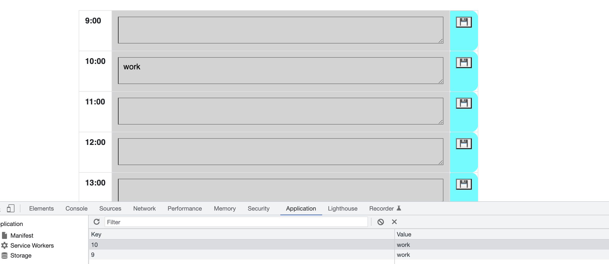

# dayPlanner

The deployed web is https://kayjinyi.github.io/dayPlanner/

## Table of Contents

- [Descripttion](#descripttion)
- [Installation](#installation)
- [Mock-Up](#mock-up)
- [Questions](#questions)

---

## Descripttion

Work Day Scheduler

Create a simple calendar application that allows a user to save events for each hour of the day by modifying starter code.

For people with a busy schedule, the users WANT to add important events to a daily planner SO THAT users can manage my time effectively. GiVEN users are using a daily planner to create a schedule

WHEN users open the planner, THEN the current day is displayed at the top of the calendar

WHEN users scroll down
THEN users are presented with timeblocks for standard business hours

WHEN users view the timeblocks for that day
THEN each timeblock is color coded to indicate whether it is in the past, present, or future

WHEN users click into a timeblock
THEN users can enter an event

WHEN users click the save button for that timeblock
THEN the text for that event is saved in local storage

WHEN users refresh the page
THEN the saved events persist

A user clicks on slots on the color-coded calendar and edits the events.

---

## Installation

This app will run in the browser and feature dynamically updated HTML and CSS powered by jQuery.

---

## Mock-Up

## Questions

Feel free to reach out via Github or email with any questions.  
[Github](https://github.com/kayjinyi)  
[email](mailto:kayjinyi@gmail.com)

---
